# TryHackMe Command
### 1. echo, whoami
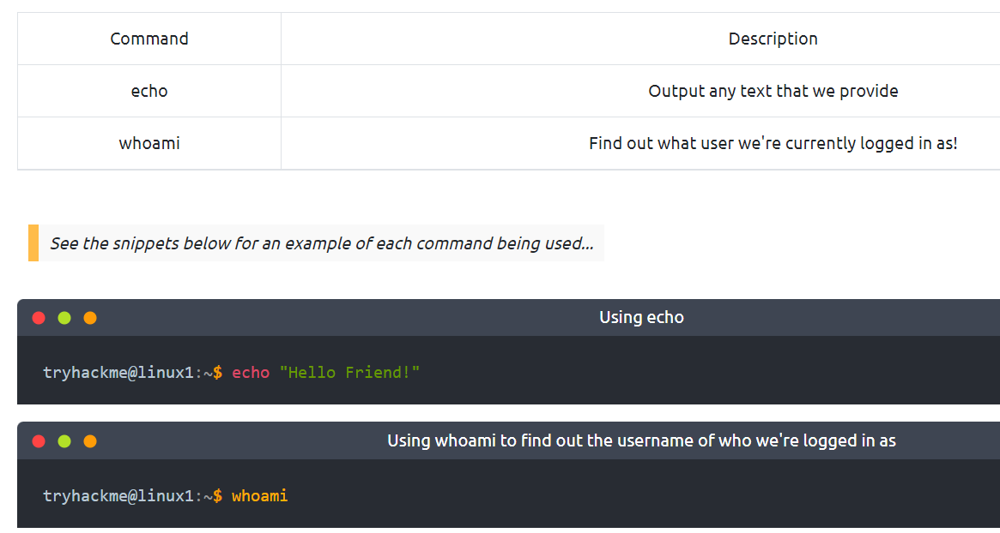   
### 2. ls, cd, cat, pwd
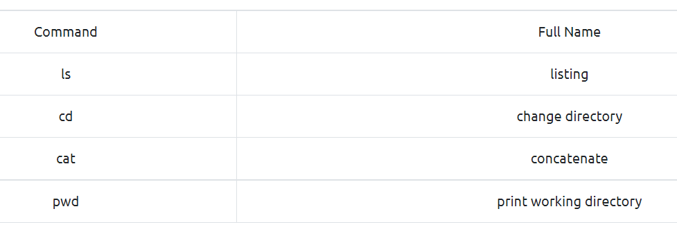   
### 3. find
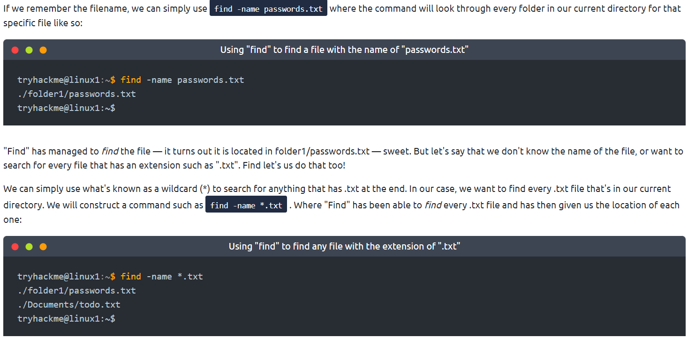   
### 4. grep (感覺像Ctrl+f的功能)
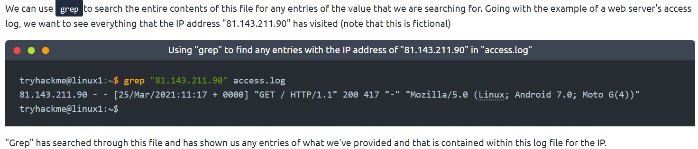   
### 5. >
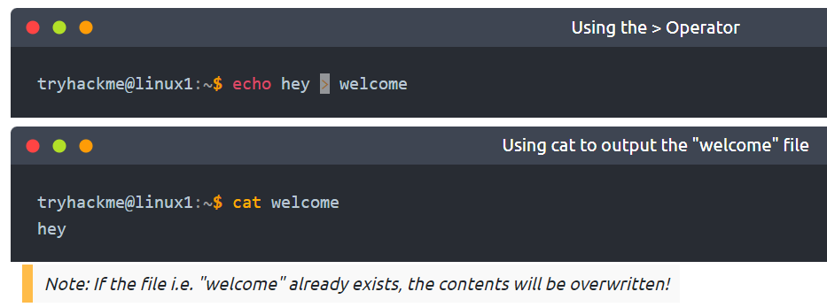
### 6. >>
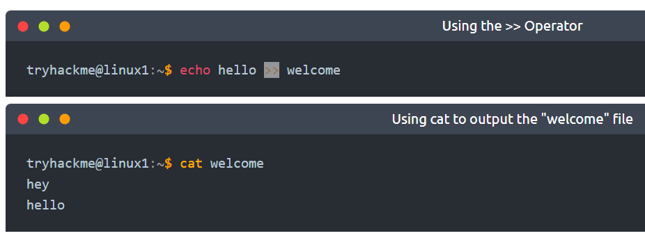
### 7. ssh {name}@IP
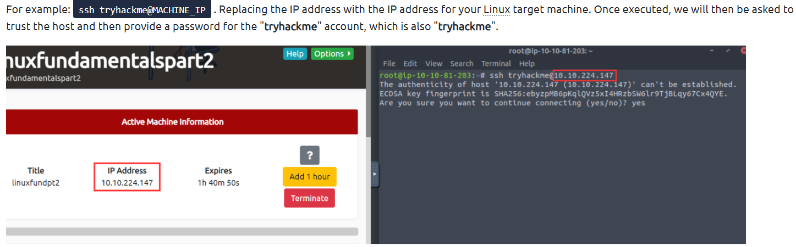
### 8. ls -a, --help
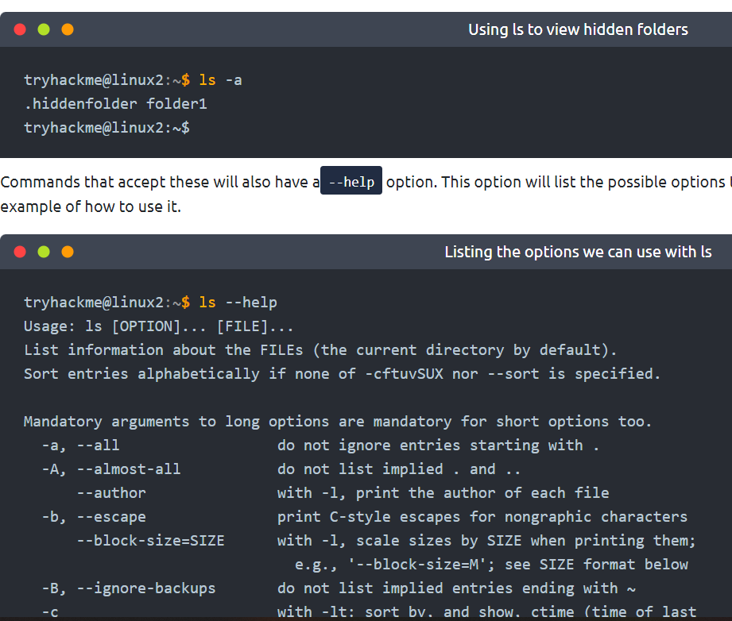
### 9. man {command}
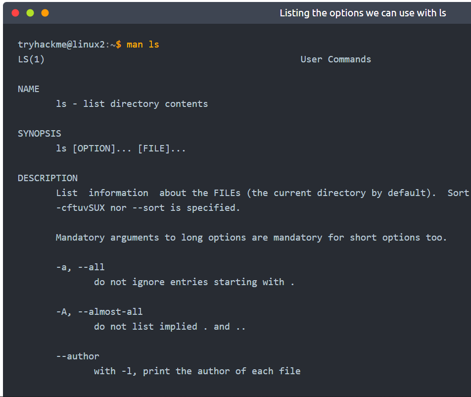
### 10. touch, mkdir, cp, mv, rm, file
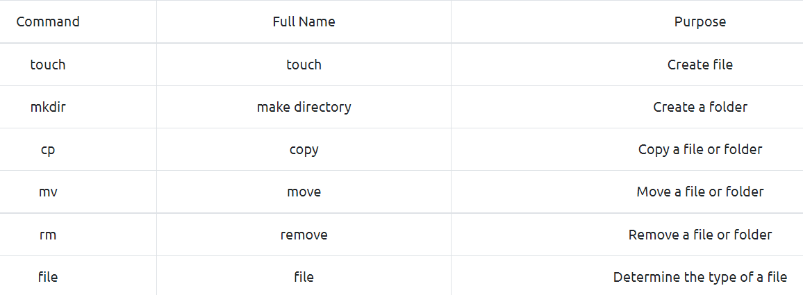
### 11. nano
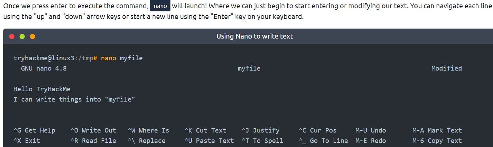
### 12. wget
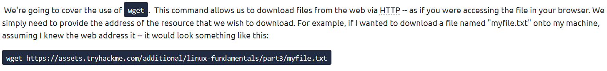
### 13. scp1
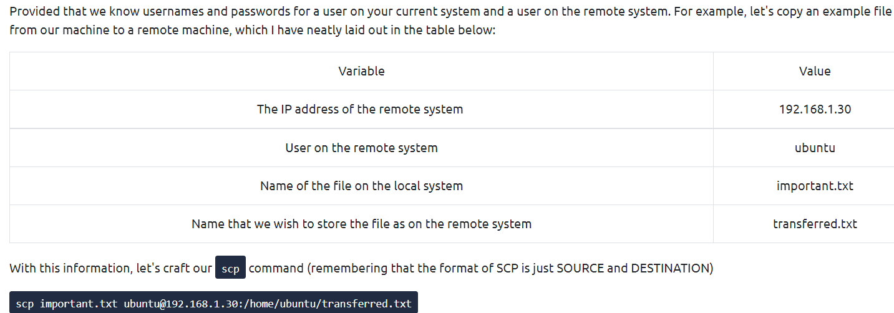
### 14. scp2
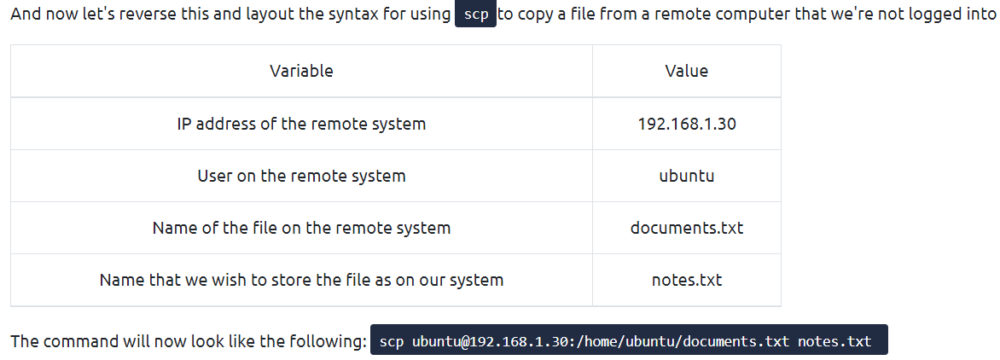
### 15. python3 -m http.server
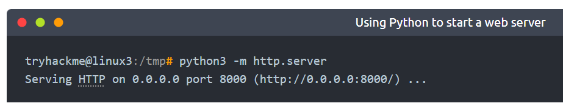
### 16. wget or curl
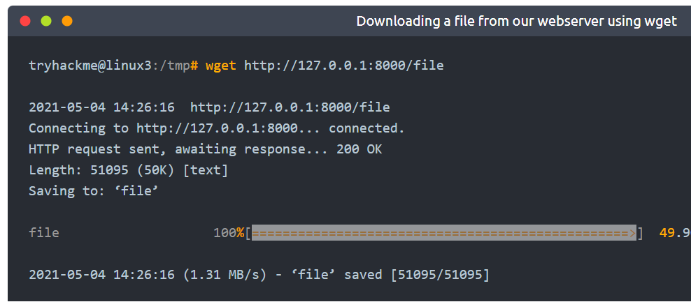
# HackTheBox Command
### 1. nmap -sC -sV {IP}
### 2. ftp {IP} + ls + get flag.txt
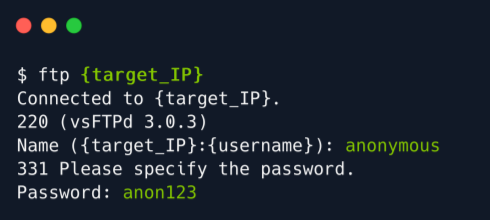